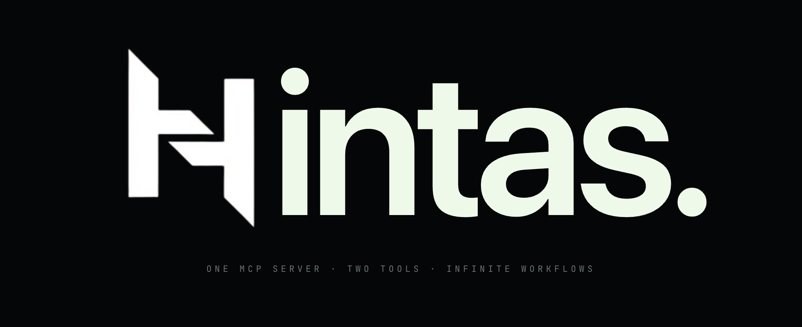

# MCP Benchmark

<p align="center">
  <a href="https://hintas.com">
    
  </a>
</p>

<p align="center">
  <strong>Official platform MCPs vs MCPs by <a href="https://hintas.com">Hintas</a>, running head-to-head on the same prompts against mirrored workspaces.</strong>
</p>

<p align="center">
  <a href="LICENSE"></a>
  <a href="pyproject.toml"></a>
  <a href="#experiments-and-results"></a>
  <a href="https://hintas.com"></a>
</p>

---

The main purpose of this benchmark is to compare the official MCPs offered by the softwares vs the MCPs built by Hintas for those softwares. The test covers popular softwares like Slack, Notion, and Gmail.

For each platform, the same prompts run under identical conditions, once against the platform's official MCP (baseline) and then against the MCP provided by Hintas (variant). The benchmark measures pass rate, token usage, tool-call count, wall time, and failure modes, then reports baseline minus variant deltas across the prompt suite.

## Experiments and Results

Each platform was run head-to-head over a fixed prompt suite (48 prompts for Slack, 58 for Notion, 42 for Gmail), with the platform's official MCP and the MCP built for them by Hintas answering the same prompts against mirrored workspaces. The tables below summarize the per-dimension verdicts, and full per-prompt breakdowns live in each platform's report.

### Slack

| Metric         | Slack MCP - Official | Slack MCP - Hintas | Δ (Hintas − Official) |
| :------------- | -------------------: | -----------------: | --------------------: |
| Success rate   |                  23% |                77% |             +54.2 pp  |
| Speed          |               16.9 s |             44.2 s |              +27.2 s  |
| Tokens         |                4,132 |             11,684 |               +7,552  |

Full report: [experiments/slack/results.md](experiments/slack/results.md)

### Notion

| Metric         | Notion MCP - Official | Notion MCP - Hintas | Δ (Hintas − Official) |
| :------------- | --------------------: | ------------------: | --------------------: |
| Success rate   |                   68% |                 80% |             +12.5 pp  |
| Speed          |                45.4 s |              48.2 s |               +2.8 s  |
| Tokens         |                78,172 |              74,411 |               −3,761  |

Full report: [experiments/notion/results.md](experiments/notion/results.md)

### Gmail

| Metric         | Gmail MCP - Official | Gmail MCP - Hintas | Δ (Hintas − Official) |
| :------------- | -------------------: | -----------------: | --------------------: |
| Success rate   |                  50% |                71% |             +21.4 pp  |
| Speed          |               29.5 s |             56.9 s |              +27.4 s  |
| Tokens         |               15,267 |             39,335 |              +24,068  |

Full report: [experiments/gmail/results.md](experiments/gmail/results.md)

## What gets measured

- Pass rate (per prompt, scored by an analyzer Claude session)
- Total input/output tokens
- Tool-call count
- Wall-clock time
- Failure modes (categorized)

## Quick start

Prerequisites:

- `uv` (`brew install uv`)
- `claude` CLI on `$PATH` (`npm i -g @anthropic-ai/claude-code`)
- `uv sync` to install Python deps

Run a benchmark:

```bash
uv run benchmark run --platform slack --stack slack    # baseline
uv run benchmark run --platform slack --stack hintas   # variant
```

Tokens are read from `experiments/<name>/.env`. See the platform README for the required variables.

Run `uv run benchmark --help` for the full subcommand and flag list.

## Implementation

For the harness internals (pipeline subcommands, output layout, manifest schema, and how to add a new platform), see [IMPLEMENTATION.md](IMPLEMENTATION.md).

---

<div align="center">

Built by **[Hintas](https://hintas.com)**

</div>